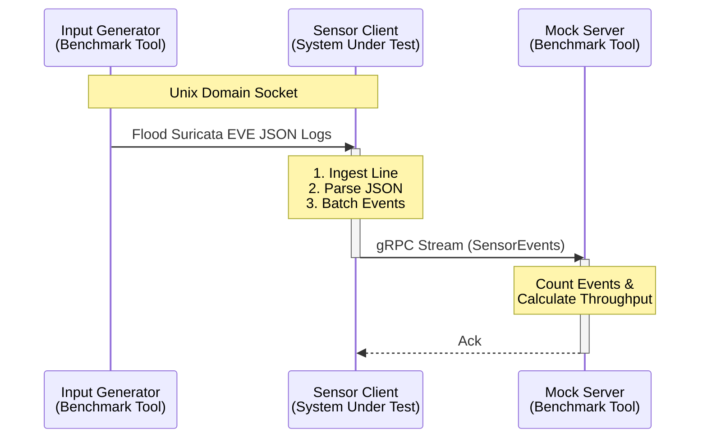

# Sensor Benchmark Tool

A specialized tooling suite designed to benchmark and stress-test the Mata Elang Sensor Client implementations (both Rust and Go).

## 🏗️ Architecture

The benchmark tool operates by simulating the entire data pipeline in a controlled environment. It acts as both the data producer (Suricata) and the data consumer (Central Server), sandwiching the Sensor Client (System Under Test) to measure its throughput and latency.



### Components

1.  **Input Generator**: Simulates Suricata by flooding valid EVE JSON logs into a Unix Domain Socket at high speed.
2.  **System Under Test (SUT)**: The Sensor Client (Rust or Go) reading from the socket and forwarding to the server.
3.  **Mock gRPC Server**: Receives the processed events via gRPC, verifies the structure, and calculates real-time throughput metrics (Events Per Second).

## 🚀 Usage

The benchmark is containerized and orchestrated via Docker Compose.

### Prerequisites
- Docker & Docker Compose

### Running the Benchmark

```bash
# Start the benchmark environment
docker-compose up --build
```

This will spin up:
- **Rust Implementation**: `benchmark-rust-app` vs `benchmark-rust-server`
- **Go Implementation**: `benchmark-go-app` vs `benchmark-go-server`

### Viewing Results

Monitor the logs to see the real-time throughput statistics:

```bash
docker-compose logs -f | grep "Server Throughput"
```

Example Output:
```text
benchmark-rust-server | Server Throughput: 93214 events/sec
benchmark-go-server   | Server Throughput: 25395 events/sec
```
